## Overview

Developed an Airflow DAG to automate daily e-commerce sales data processing using Spark. Leveraged SubmitSparkOperator to submit jobs for data transformation. Generated reports with key metrics (sales, customers, products) and stored results in S3 for centralized logging and accessibility, optimizing reporting workflows.

### Data that needed to be processed (0.5 Million Rows)

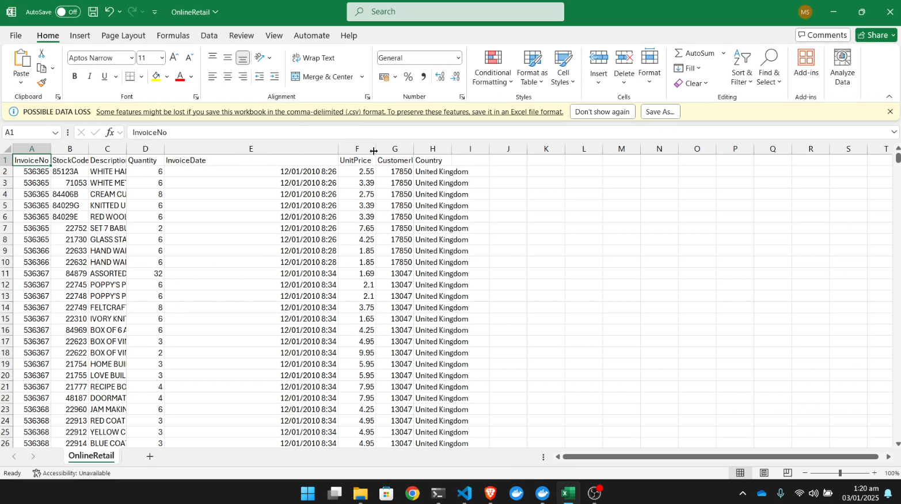

### Created DAG that runs daily

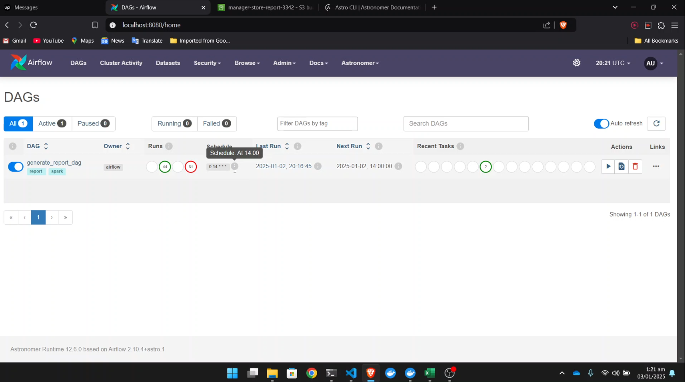

### Spark running locally using Docker

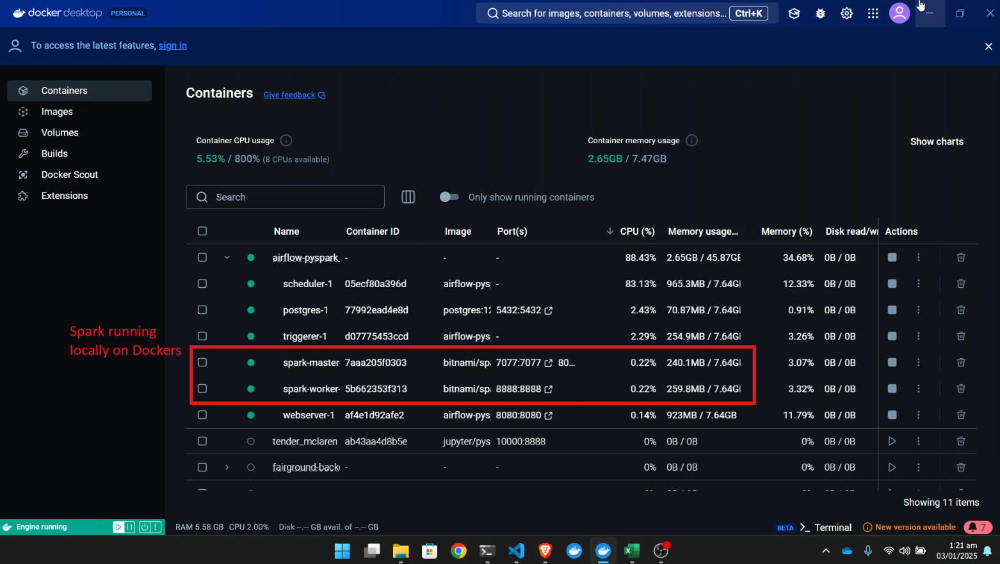

### Graph view of the DAG

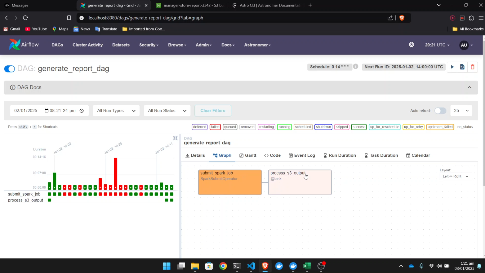

### Using SparkSubmitOperator to submit Spark job

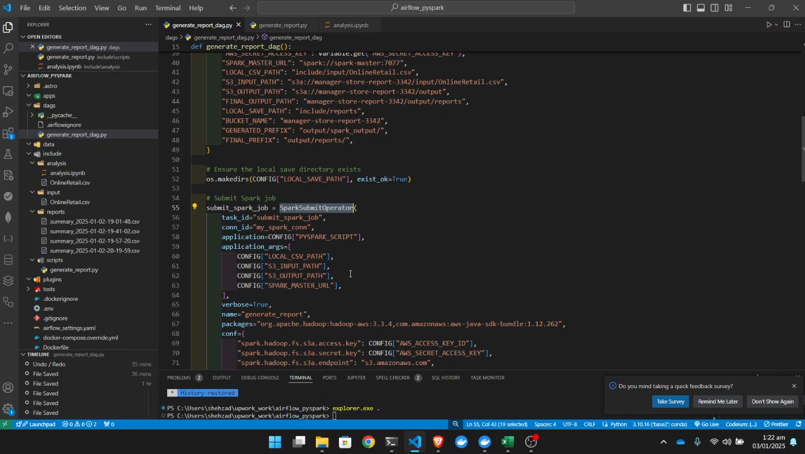

### Logs of the first task that generated the report using PySpark

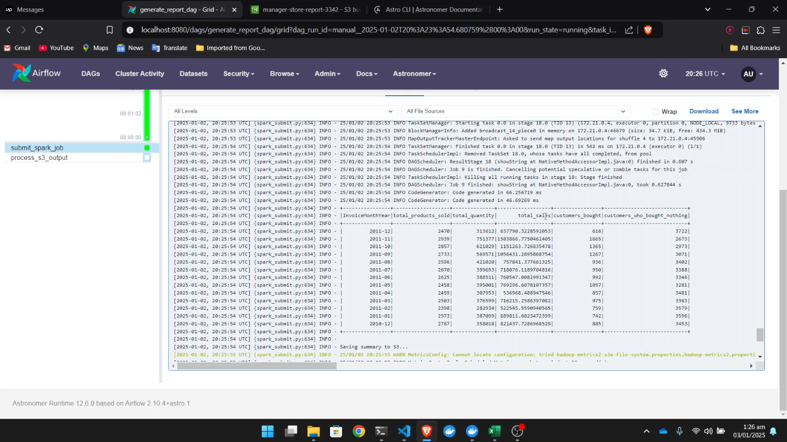

### Report saved in S3 Bucket

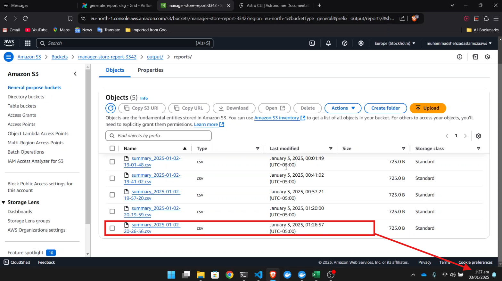

### A copy of the report is saved locally too

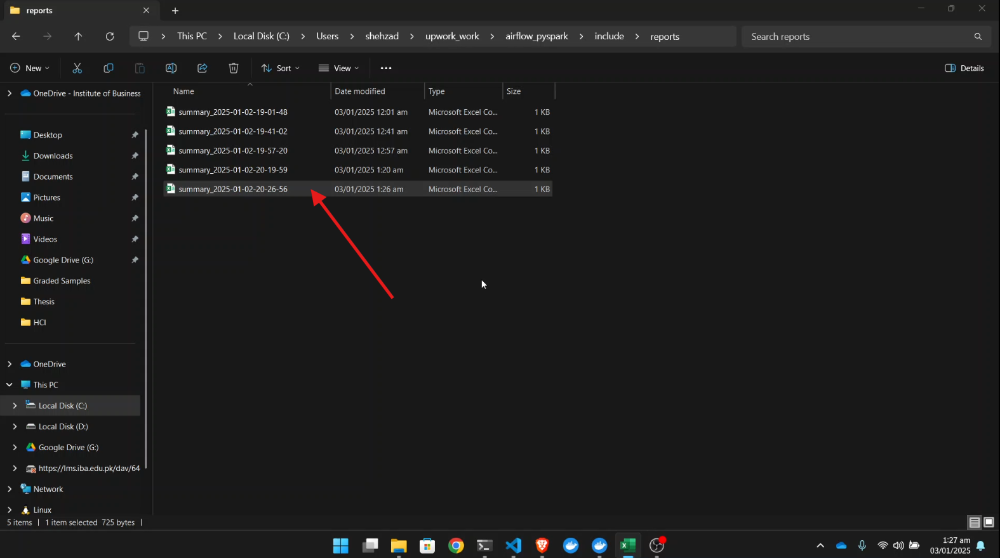

### View of the generated report

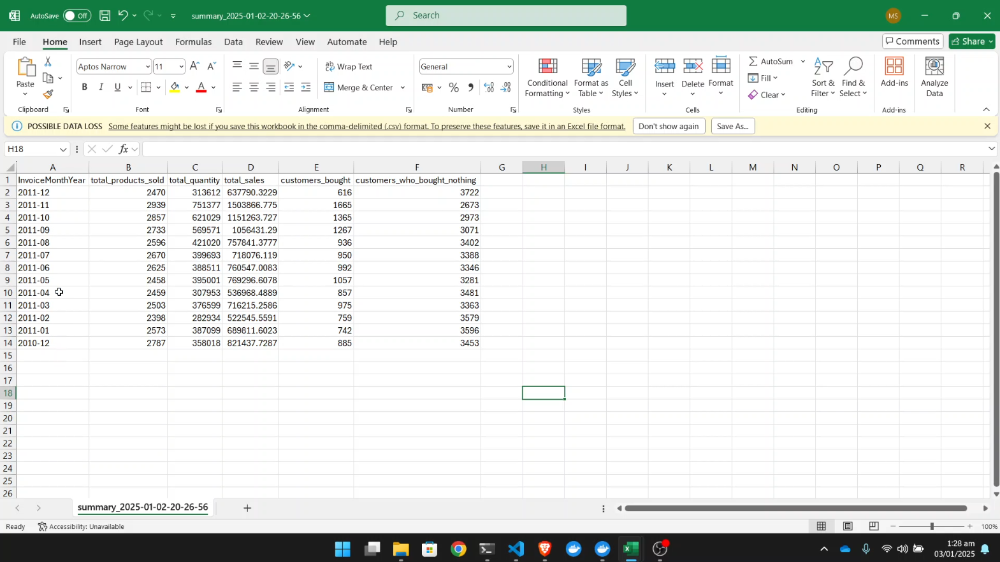

### All configs in one place for easy modifications

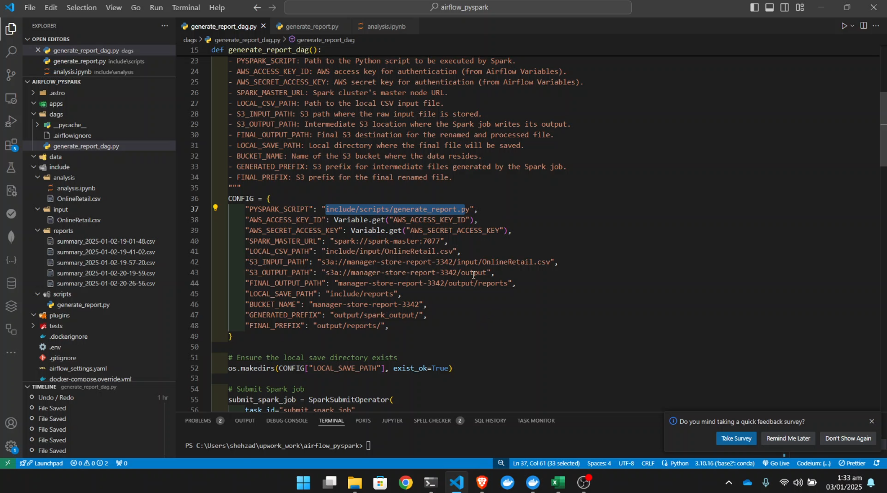

### AWS credentials stored securely as variables in Airflow

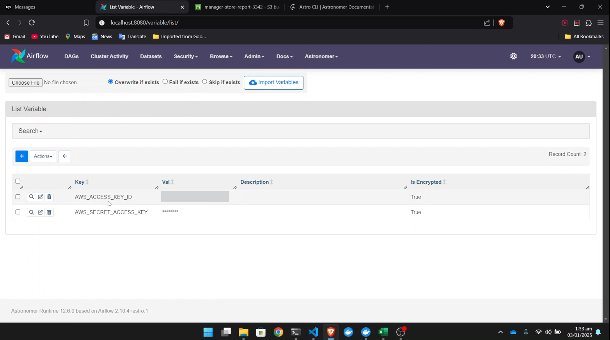

### Connection to Spark saved in Airflow for easy access

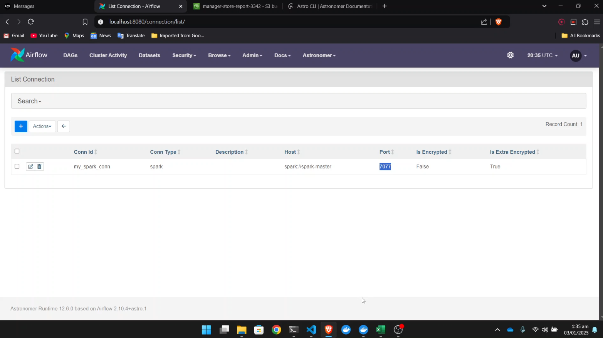

## How to run?

- Clone this repo

```
git clone
```

- Add your AWS creds in Airflow, S3 Bucket path in config.
- Install [Astro CLI](https://www.astronomer.io/docs/astro/cli/install-cli/)
- Start Airflow and Spark with a single command

```
astro dev start
```
